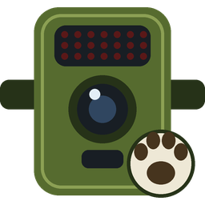

# Trailwatch

A Home Assistant integration for **Tactacam Reveal** cellular trail cameras. It keeps
a local archive of every photo, sorts the photos by what is in them (deer, turkey,
person, empty frame, …), sends phone alerts only for real sightings, and lets you
review the photos it was unsure about from a dashboard card.

> **Unofficial.** Trailwatch is not affiliated with, endorsed by or supported by
> Tactacam. It signs in to your Reveal account the same way the Reveal web portal
> does and uses that portal's private web API, which Tactacam can change at any
> time. Use it with your own account only. "Tactacam" and "Reveal" are trademarks
> of their owners and are used here only to say which cameras this works with.

## Features

- **Archive**: photos are downloaded to your Home Assistant media folder
  (`/media/tactacam_reveal/<camera>/<category>/`) and browsable under
  **Media → Tactacam Reveal**, including an "All sightings" view.
- **Classification**: a local camera-trap model (Google SpeciesNet, optional) decides
  most photos for free; unclear ones go to an AI Task entity (for example Claude or
  OpenAI), with an optional stronger AI Task for a second opinion. Or skip the local
  model and use the AI Task for everything.
- **Phone alerts** for real sightings only, with quiet labels (for example
  `squirrel`), per-camera rules and a cooldown. Tapping an alert opens a photo page
  with **Share/Save**, **Request video** and **Close**.
- **Videos**: Reveal uploads a clip only when it is requested. Trailwatch downloads
  requested clips, pairs each with its photo, classifies it, and can **request clips
  automatically** for the animals you choose (one request at a time, as Reveal
  requires).
- **Review card** ("Trailwatch Review") to sort the photos the classifier was unsure
  about: one tap per photo, arrow keys on desktop.
- **Entities** per camera (battery, signal, last sighting with photo, sightings today)
  and for the account (photo processing, photos to review, video requests, local vs
  cloud usage and estimated AI cost).

## Tested with

Trailwatch has been used and tested on **one setup only** so far. Other cameras and
environments will probably work, but have not been tried. Reports are welcome.

| | Tested | Not tested yet |
|---|---|---|
| Cameras | 2 × Tactacam Reveal **Pro 4** (`reveal-pro-4-tms`, hardware R10.1), Pro plan with Pro Xtra | Other Reveal models (X, SK, Gen 2/3, …), shared cameras, accounts with many cameras |
| Home Assistant | Home Assistant OS **2026.9.0** in a virtual machine (UTM on an Apple Silicon Mac), remote access via Home Assistant Cloud | Container / Core installs, Raspberry Pi |
| Classifier server | macOS on Apple Silicon (M2 Pro, 16 GB), Python 3.11, SpeciesNet 5 | Linux, Windows, Docker |
| AI Task | Anthropic: Claude Haiku 4.5 (fallback) and Claude Opus 5.5 (second opinion) | OpenAI, Google and other AI Task providers |
| Phone | Home Assistant Companion app on iPhone | Android |
| Location | United States: deer, turkey, raccoon, opossum, box turtle, coyote, squirrel, … | Other regions and species |

## Requirements

- Home Assistant **2026.9** or newer.
- A Tactacam Reveal account with at least one camera.
- For AI classification: an **AI Task** entity that can analyse images (for example
  the Anthropic or OpenAI integration).
- Optional, recommended: the **camera-trap classifier** server
  ([corgicommander/camera-trap-classifier](https://github.com/corgicommander/camera-trap-classifier)),
  which runs SpeciesNet on a computer in your network (about 1 GB of memory).
- For phone alerts: the Home Assistant Companion app.

## Installation

### HACS (custom repository)

1. HACS → ⋮ → **Custom repositories** → add
   `https://github.com/corgicommander/ha-trailwatch` as type **Integration**.
2. Install **Trailwatch** and restart Home Assistant.
3. **Settings → Devices & services → Add integration → Trailwatch**, then sign in with
   your Reveal email and password.

### Manual

Copy `custom_components/tactacam_reveal` into your Home Assistant
`config/custom_components/` folder and restart.

The first sync archives your existing photos quietly (no alerts).

## Settings

Open the integration and choose **Configure**:

| Page | What it controls |
|---|---|
| **Downloads & storage** | Check interval, photo and video downloads, **Automatically request videos** (a second page asks which animals trigger a request; blank requests every clip, including empty frames), a Home Assistant notification for every new photo, and deleting empty photos after a number of days. |
| **Classification** | Classifier server URL, country and region (improves species accuracy), minimum confidence, AI Task entity, stronger AI Task entity, extra AI instructions, label aliases (for example `eastern cottontail=rabbit`) and the cost per AI call used for the savings estimate. |
| **Phone notifications** | Which phones get alerts, the cooldown per camera and animal, quiet labels and an optional "only these labels" list. |
| **Per-camera settings** | Turn classification or alerts off per camera, per-camera label lists and scene notes for the AI (for example "the round grey rock is not a turtle"). |

### Local model or AI only?

| | Local classifier + AI fallback | AI only |
|---|---|---|
| Setup | Run the classifier server | Nothing extra |
| Cost | Free for most photos; AI only for unclear ones | AI tokens for every photo and clip |
| Videos | Several frames per clip | One frame per clip (Home Assistant's ffmpeg) |

Leave **Classifier server URL** empty for AI only.

### Improving the AI on a tricky scene

Put one or two photos of the empty scene in `<camera>/reference/` (the review card's
**Use as reference** does this) and, if needed, a `scene.txt` with notes. The AI
compares new photos against them.

## Review card

Add the **Trailwatch Review** card from the dashboard card picker. It needs no
configuration and no resource setup; the integration loads it. It shows the current
photo, what the classifier thought, one-tap labels, a field for a new label, and
Previous / Skip / Use as reference / Ask AI. With a downloaded clip it can also play
the video.

```yaml
type: custom:tactacam-review-card
```

## Videos

Reveal cameras record a short clip but upload only a still (its file name contains
`-V-`). The clip is uploaded when it is requested, in the Reveal app, on Trailwatch's
photo page (**Request video**) or automatically. Reveal processes **one request at a
time**: a second request sent while one is outstanding is skipped. Trailwatch
therefore queues requests and sends the next one when the clip arrived or after an
hour. The **Video requests** sensor shows the queue.

Uploading video uses camera battery.

## Phone alerts on iPhone

- The photo appears when you **long-press** the alert. If it never appears, check
  iOS Settings → Notifications → Home Assistant → Show Previews (Always), and turn
  off Low Data Mode and Low Power Mode, then open the Companion app once.
- Tapping the alert opens Trailwatch's photo page.
- After updating Trailwatch, refresh the app's frontend (Companion App → Debugging →
  Reset frontend cache) if a card or page looks outdated.

## Services

| Service | Purpose |
|---|---|
| `tactacam_reveal.classify_media` | Classify one archived photo (optionally sort it). |
| `tactacam_reveal.classify_archive` | Classify unsorted photos, optionally per camera and date range. |
| `tactacam_reveal.sort_media` / `relabel` | Move a photo (and its clip) to a label's folder. |
| `tactacam_reveal.set_reference` | Use a photo as the camera's empty-scene reference. |

## Events

- `tactacam_reveal_new_media`: a photo or clip was archived.
- `tactacam_reveal_media_classified`: category, labels, subject, reason, source
  (`local` or `ai`), whether an alert was sent, and a signed `image_url`.

## Privacy

Your Reveal email and password are stored in Home Assistant's config entry and are
redacted from diagnostics. Photos are stored in your own media folder. With the local
classifier, photos never leave your network; photos sent to an AI Task are processed
by that AI provider.

## How this was made

Trailwatch was written by **[Claude Code](https://claude.com/claude-code)**
(Anthropic's AI coding agent) working with the repository owner, who set the
requirements, tested every feature on the setup above and reviewed the results. Read
the code before relying on it, and please report anything that does not work.

## License

MIT. See [LICENSE](LICENSE).
